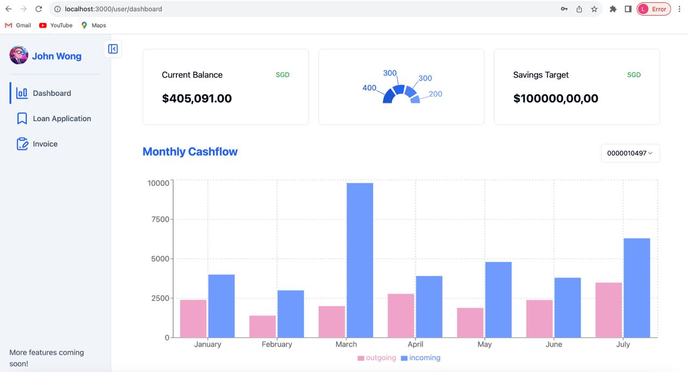

# DBEA-freelancer-banking

<a name="readme-top"></a>

<!-- PROJECT LOGO -->
<br />
<div align="center">
  <a href="https://github.com/IS213-G9-tokyobanana/carbon-marketplace-backend">
    
  </a>

<h3 align="center">DBEA Freelancer Banking</h3>

  <p align="center">
    A banking system for freelancers to have the financial supports they need.
    <br />
  </p>
</div>

<!-- TABLE OF CONTENTS -->
<details open>
  <summary>Table of Contents</summary>
  <ol>
    <li>
      <a href="#about-the-project">About The Project</a>
      <ul>
        <li><a href="#built-with">Built With</a></li>
        <li><a href="#methods-of-communication">Method of Communication</a></li>
      </ul>
    </li>
    <li>
      <a href="#initial-setup">Initial Setup</a>
      <ul>
        <li><a href="#prerequisites">Prerequisites</a></li>
        <li><a href="#usage">Usage</a></li>
      </ul>
    </li>
  </ol>
</details>

<!-- ABOUT THE PROJECT -->

## About The Project

  <p align="center">
    A Gateway to Financial Stability and Business Growth
    <br />
  </p>

In the dynamic realm of freelance work, where individuals harness their expertise to serve a vast array of clients, financial management can often pose a significant challenge. This is where our project emerges as a beacon of hope, a comprehensive solution that seamlessly integrates loan application services and invoice generation, transforming the financial landscape for freelancers worldwide.

### Loan Application Assistance: Bridging the Gap to Financial Growth

Unforeseen expenses, equipment upgrades, and business expansion can often strain the finances of even the most successful freelancers. Our project offers a lifeline of support, providing access to tailored loan options that align with individual needs and financial profiles.

### Streamlined Invoice Generation: Ensuring Prompt Payment and Business Efficiency

The process of generating invoices, a crucial aspect of freelance work, can be time-consuming and prone to errors. Our project revolutionizes this process, introducing automated invoice generation tools that effortlessly capture project details, calculate fees, and produce professional-looking invoices.

<p align="right">(<a href="#readme-top">back to top</a>)</p>

### Built With

- [FastAPI](https://fastapi.tiangolo.com) (Python Web Framework)
- [Docker](https://www.docker.com/) (Container Runtime)
- [TBank](http://tbankonline.com/SMUtBank_API_Help/API%20Documentation.html) (External Banking API)

### Methods of Communication

- REST API (HTTP)

<p align="right">(<a href="#readme-top">back to top</a>)</p>
<!-- GETTING STARTED -->

## Initial Setup

To get a local copy of all the microservices up and running follow these steps.

### Prerequisites

- [Docker](https://docs.docker.com/get-docker/)

### Usage

1. Clone the repository
   ```bash
   git clone https://github.com/Jaylin0312/DBEA-freelancer-banking.git
   ```
2. Initialize repo with .env file

3. Start the services

   To start the frontend service, run

   ```bash
   cd freelancer-frontend
   npm install
   npm run dev
   ```

   To start the backend services, run

   ```bash
   cd freelancer-backend
   docker compose up --build
   ```

4. To stop the backend services, run

   ```bash
   docker compose down
   ```

   <p align="right">(<a href="#readme-top">back to top</a>)</p>
